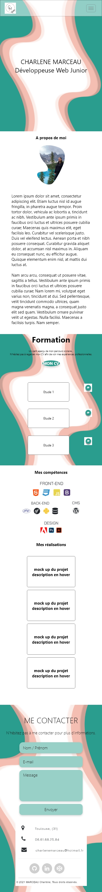
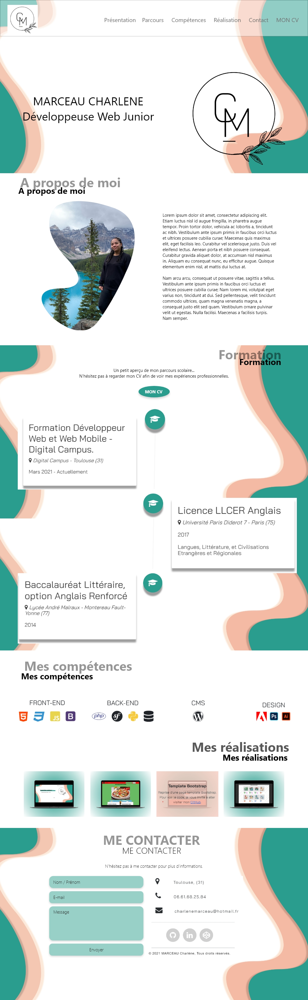

# TP-Portfolio Charlène Marceau
 Créative de mon premier portfolio lors de ma formation Web Dev

## MAQUETTE 

### La première maquette

- Aspect visuel sans identité graphique  

### Recherche d'identité graphique 

J'ai rencontré quelques difficultés afin de trouver mon identité graphique, j'ai plusieurs fois changé de palettes de couleurs mais j'ai fini par trouver des couleurs qui me correspondaient.

## Format mobile 

### Maquette finale 

## LANGAGES ET BIBLIOHEQUES

- Ce portfolio a été réalisé à l'aide de HTML5, CSS, Javascript ainsi que de Bootstrap.

## Difficultés
- J'ai surtout rencontré des difficultés pour réaliser la Timeline :
  En effet, je voulais une timeline avec animation, il me fallait donc utiliser du javascript. Sans réelle connaissance du langage en début de projet, réaliser cette timeline était un bon défi. 

- La présentation des compétences m'a aussi apporté quelques difficultés. Je suis tout d'abord partie sur l'idée de les présenter grâce à des barres de progressions mais l'aspect visuel et la non représentation de mon réel niveau ne m'a pas plus. J'ai donc décidé de minimiser en partant sur des icons avec des compétences que je maitrîse réellement.
  
- Le côté responsive a également été un défi puisqu'il fallait gérer plus ou moins plusieurs écrans. Je voulais rendre mon portfolio responsive et accessible via mobile et ordinateur. Bootstrap ne pouvant pas gérer tout le côté responsive, j'ai dû également travailler avec le CSS pour gérer le côté responsive.

- Le formulaire de contact. A retravailler lorsque j'aurais plus de connaissance avec Javascript et la partie Back-end.